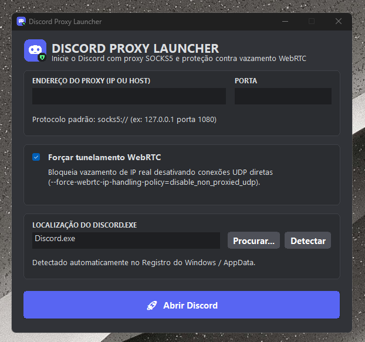

# 🚀 Discord Proxy Launcher - Windows 11

Aplicativo nativo para Windows 11 com o visual oficial do Discord (Dark Theme) que permite iniciar o Discord configurado com servidor de Proxy (SOCKS5/HTTP) e proteção contra vazamento de IP via WebRTC.

<p align="center">
  
</p>

---

## ✨ Recursos

* **Configuração Simples de Proxy**: Endereço do Servidor (IP ou Host) e Porta.
* **Proteção contra Vazamento WebRTC**: Flag `--force-webrtc-ip-handling-policy=disable_non_proxied_udp` integrada.
* **Detecção Automática do Discord**: Localiza automaticamente o caminho da instalação no Registro do Windows (`HKCU`) e `%LOCALAPPDATA%`.
* **Detecção de Instâncias Abertas**: Identifica se o Discord já está em execução, solicitando autorização para encerrá-lo e reabri-lo com as novas configurações de proxy.
* **Salvamento Local Silencioso**: Salva as credenciais em `DiscordProxyLauncher.config` ao lado do executável.
* **Fechamento Automático**: Fecha o inicializador imediatamente após disparar o processo do Discord.
* **Interface Nativa Win32**: Leve (~2 MB), sem console preto, zero dependências externas ou frameworks pesados.
* **Ícone Oficial com Badge de Proxy**: Embutido como recurso PE (`MAINICON`) visível no Windows Explorer, Alt+Tab e barra de tarefas.

---

## 📥 Download

Baixe o executável pronto na aba de **[Releases](https://github.com/jeansf/discord-proxy-launcher/releases)** do repositório:
* **`DiscordProxyLauncher.exe`** (Compatível com Windows 10 e Windows 11 64-bit)

---

## 🛠️ Processo de Build (Compilação do Código-Fonte)

### Pré-requisitos

1. **Go 1.20 ou superior**: [golang.org](https://go.dev/dl/)
2. **go-winres** (ferramenta para embutir ícones e manifesto DPI no Windows):
   ```bash
   go install github.com/tc-hib/go-winres@latest
   ```
3. *(Opcional)* **Python 3 com Pillow** (caso queira recriar os arquivos de ícone `.ico` e `.png`):
   ```bash
   pip install pillow
   python generate_icon.py
   ```

---

### Passo 1: Gerar os Recursos do Windows (`.syso`)

O arquivo `.syso` embute o ícone no cabeçalho do executável e ativa o suporte a Dark Mode e High-DPI no Windows:

```bash
go-winres simply --arch amd64 --manifest gui --icon icon.ico --file-description "Discord Proxy Launcher" --product-name "Discord Proxy Launcher" --original-filename "DiscordProxyLauncher.exe"
```

Isso gerará o arquivo `rsrc_windows_amd64.syso` na raiz do projeto.

---

### Passo 2: Compilar o Executável

#### Compilando no Linux (Cross-Compilation para Windows 64-bit)
```bash
GOOS=windows GOARCH=amd64 go build -ldflags="-H=windowsgui -s -w" -o DiscordProxyLauncher.exe .
```

#### Compilando diretamente no Windows (CMD ou PowerShell)
```powershell
$env:GOOS="windows"; $env:GOARCH="amd64"; go build -ldflags="-H=windowsgui -s -w" -o DiscordProxyLauncher.exe .
```

> **Explicação das flags de compilação:**
> * `-H=windowsgui`: Oculta o console/terminal do Windows (inicia diretamente a interface gráfica).
> * `-s -w`: Remove símbolos de depuração e DWARF, reduzindo o tamanho final do binário.

---

## 🤖 Automação de Releases (GitHub Actions)

O repositório possui um workflow automatizado em `.github/workflows/release.yml`. Para gerar uma nova Release oficial com o executável compilado:

1. Crie e envie uma tag de versão:
   ```bash
   git tag v1.0.1
   git push origin v1.0.1
   ```
2. O GitHub Actions irá compilar automaticamente o binário e anexar o `DiscordProxyLauncher.exe` na página de Releases do repositório.

---

## 🐍 Versão Alternativa (Python / Tkinter)

Caso deseje executar ou modificar o script em Python diretamente:

```bash
pip install pillow
python discord_launcher.py
```
